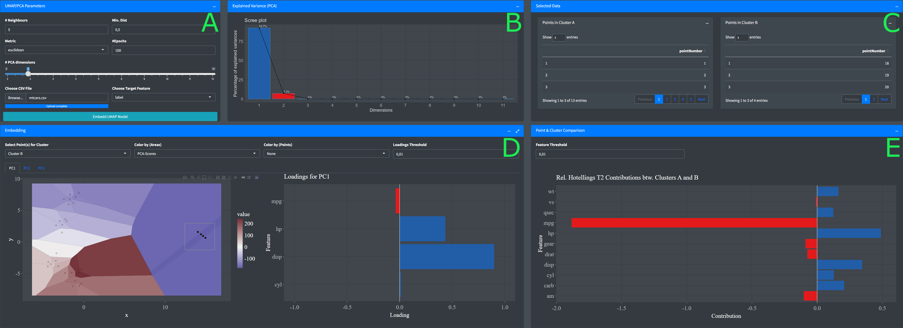

# X-MAP GUI
A shiny app for deriving local/global explanations of UMAP embeddings based on principal component analysis (PCA).

- (A) File import, UMAP settings, number of PCs
- (B) Fraction of explained variance per PC
- (C) Data points in selected clusters
- (D) UMAP embedding and loadings
- (E) Discriminatory features between clusters A and B

# Installation
The easiest way to install the X-MAP is from within the RStudio IDE. Just run server.R. We recommend running the app in a web browser.

# Usage
- Load dataset: Click browse in (A) and choose an .csv data file. See ./data/example_dummy or ./data/example_iris for an example.
- Parameterization: Choose number of neighbors, minimal distance, distance metric, training epochs and number of PCs, and press "Embedd UMAP Model"
- Visualization: The fraction of explained variance (B), embedding and PC loadings (D) are displayed. The optimal number of PCs is indicated as red bar. 
Separate tabs for every PC are available. The Voronoi areas can either be colored according to the corresponding PCs score or the Q-Residuals. The latter
indicates how well represented each data point is by the corresponding PC (low values means the data is well represented). Optionally points can be colored 
according to the values of individual variables and a threshold for the loadings to be displayed might be used to reduce the number of variables in the plot.
- Cluster comparison: Select "Cluster A" from the selection bar on the top left (D) and mark data point(s) in the embedding. Then, select "Cluster B" and select
data points to be compared with the points from the other clusters. Note that the mean of all data points of each cluster is calculated when choosing multiple points per cluster.
Once both clusters are selected, the corresponding data points show up in (C) and relative Hotelling's T2 contributions indicating the feature importance of each variable for discrimination of the 
clusters are shown in (E).

An Iris dataset example:

# Notes
Be aware that this is a prototype implementation. Not all user interface components ar fully responsive and the calculations are not optimized.

# Reference
<a id="1">[1]</a> Roman Josef Rainer, Michael Mayr, Johannes Himmelbauer, Ramin Nikzad-Langerodi (2022).
Opening the black-box of Neighbor Embedding with
Hotelling's T2 statistic and Q-residuals.

# Contact
michael.mayr@scch.at
roman.rainer@scch.at
ramin.nikzad-langerodi@scch.at

